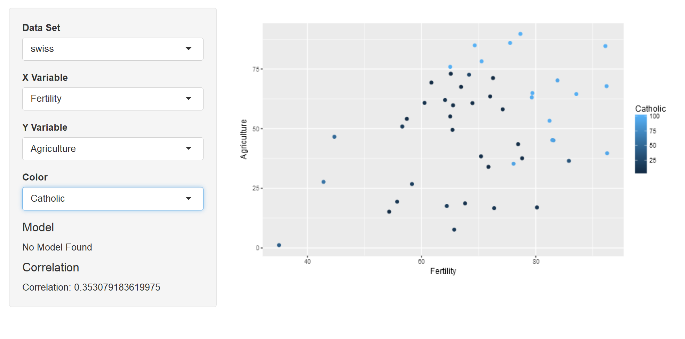
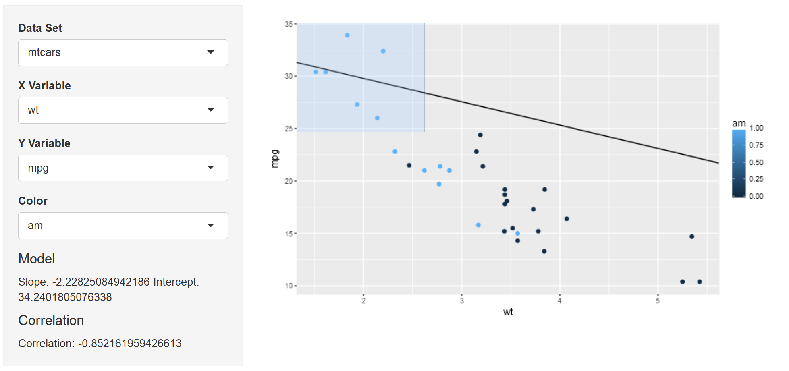

<!-- Limit image width and height -->
<style type='text/css'>
img {
    max-height: 560px;
    max-width: 964px;
}
</style>

<!-- Center image on slide -->
<script src="http://ajax.aspnetcdn.com/ajax/jQuery/jquery-1.7.min.js"></script>
<script type='text/javascript'>
$(function() {
    $("p:has(img)").addClass('centered');
});
</script>

```{r setup, include=FALSE}
knitr::opts_chunk$set(echo = FALSE)
```

## Overview
This shiny app was built for the *Developing Data Products* Course for the online John Hopkins *Data Specialization*.
This app aims at helping on the exploratory analysis step of a data analysis. 


**Paired Graphs** are one of the most used first steps to determine the potential relationships between variables.


As such, this app aims to make it easier to take a closer look at those behaviours and potential confounders.

[github](https://github.com/SergioAPH/ExploratoryPairsJH)
[shiny](https://sergioaph.shinyapps.io/Project/)

## Inputs

- Dataset:

Pick a data set to explore **For purposes of the class only two options are available** 

- X Variable

Pick the Variable for the X axis, this is set as the potential predictor.

- Y Variable

Pick the Variable for the Y axis, this is set as the variable of interest.


## Inputs


- Color

Pick a third Variable, explore if it is a potential confounder!

- Brush

Select clusters of points and find a linear model for that cluster!

## Outputs

- Model

Shows the coefficients of the slope and intercept of the selected points.

- Correlation

Shows the correlation between the two variables

-Plot 

Plots the specified x variable, y variable and color if specified from the specified dataset.


## Examples
    


## Examples



